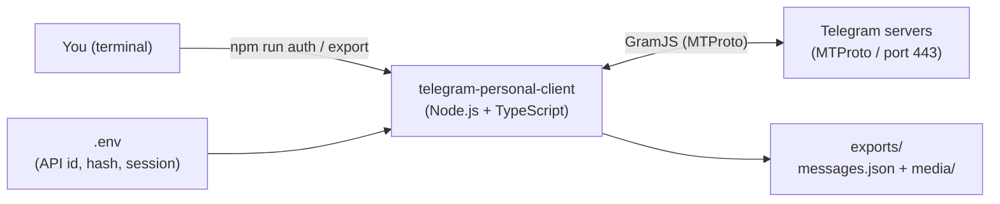
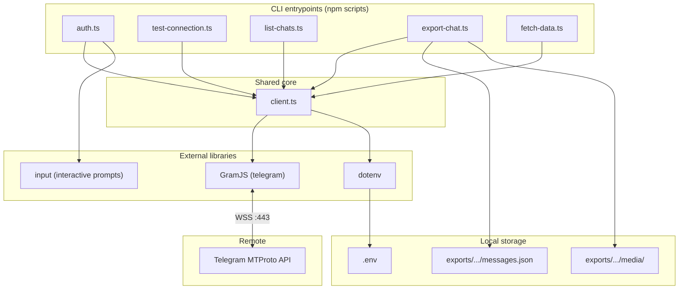
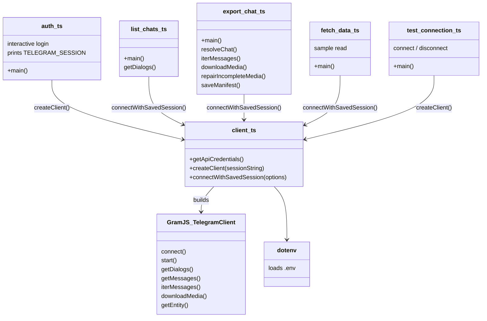
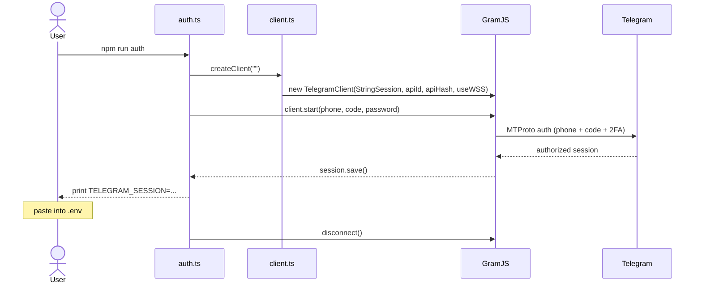
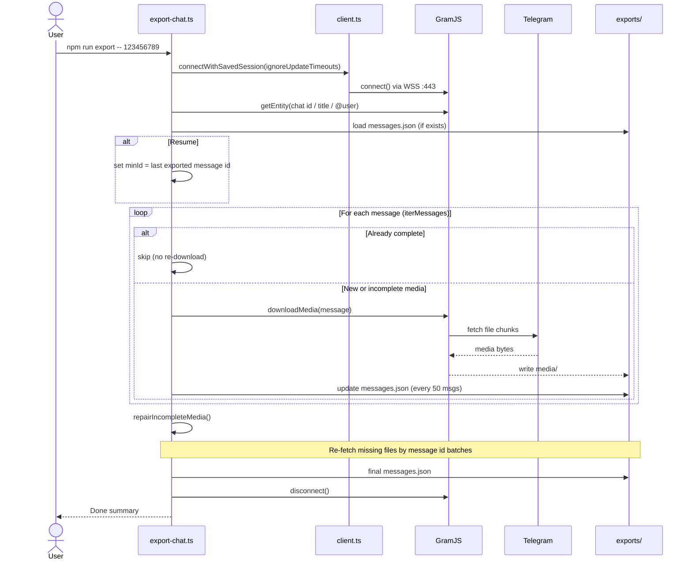
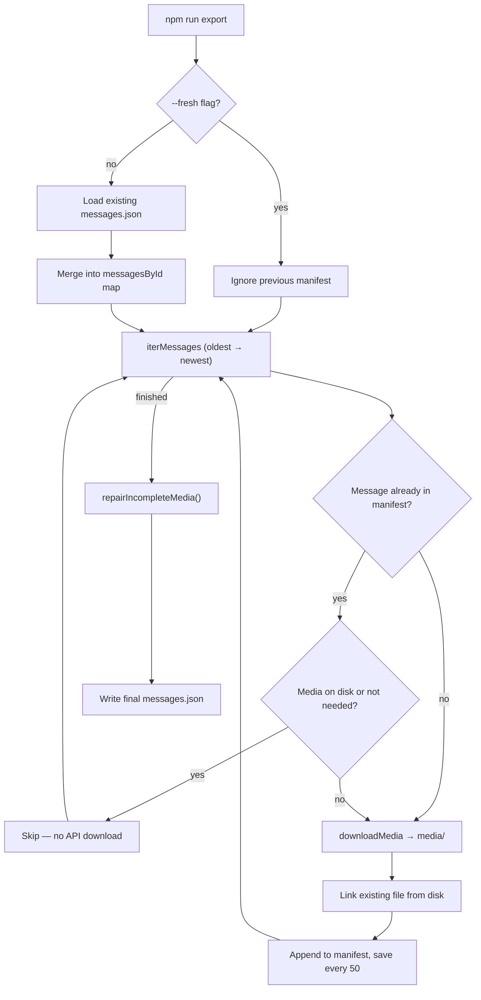
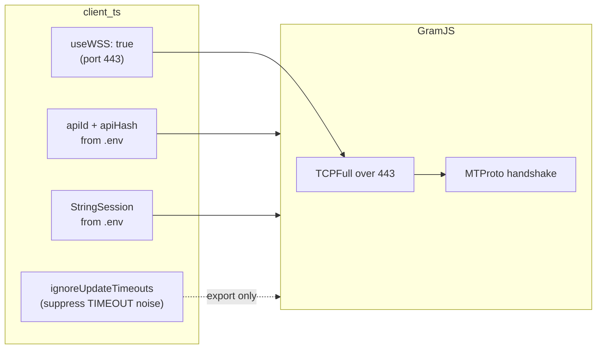
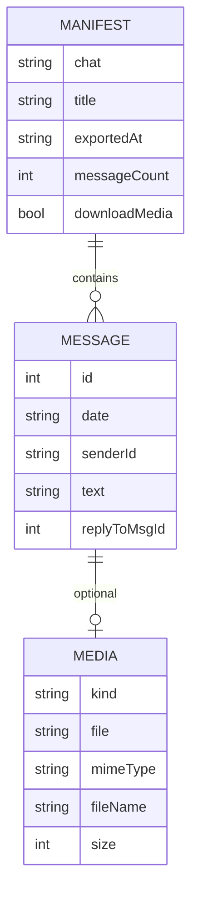
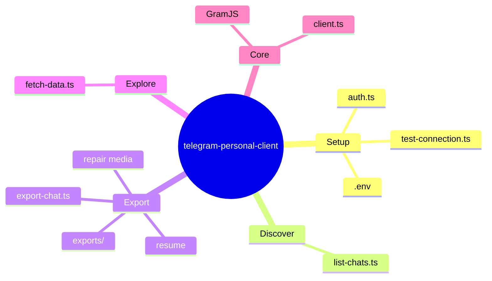

# Architecture

Visual overview of how **telegram-personal-client** is structured and how data flows through it.

## 1. System context

How the tool sits between you, Telegram, and local files.



**Key point:** This is **not** the Bot API. It logs in as your **user account** via MTProto (same protocol as the official app).

---

## 2. Layered structure



| Layer | Role |
|-------|------|
| **CLI scripts** | Thin runners invoked by `npm run …` |
| **client.ts** | Single place for credentials, session, connection options |
| **GramJS** | MTProto client — dialogs, messages, media download |
| **Local files** | Session secrets in `.env`; export output on disk |

---

## 3. Module dependency diagram (UML-style)



---

## 4. Authentication flow (one-time)



After this, all other scripts use `TELEGRAM_SESSION` from `.env` — no repeated login.

---

## 5. Export flow (with resume)



---

## 6. Export resume decision logic



---

## 7. Connection configuration



Port **80** is avoided by default because many networks block or reset it. **443 (WSS)** is used instead.

---

## 8. On-disk data model



**Folder layout:**

```
exports/<chat-title-slug>/
├── messages.json    ← MANIFEST + MESSAGE[] + MEDIA
└── media/
    └── {messageId}_{type}.{ext}
```

---

## 9. Script map (quick reference)



---

## 10. Technology stack

| Piece | Choice | Why |
|-------|--------|-----|
| Runtime | Node.js | GramJS target platform |
| Language | TypeScript | Typed scripts, `tsx` runner |
| Telegram access | GramJS (`telegram`) | MTProto for **personal** accounts |
| Session | `StringSession` | Portable auth string in `.env` |
| Transport | WSS / port 443 | Works when port 80 is blocked |
| Config | `dotenv` | Keep secrets out of code |
| CLI input | `input` | Phone / code / 2FA during `auth` |
